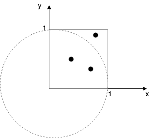

Content
---
This repository contains MPI programs which were used to experiment
with naturally concurrent problems.

Main program is `get_pi.py` which calculates Pi value using Monte Carlo method.



In each step program generate random point `(x,y), 0 <= x,y <= 1`. It
is surely in the square on the diagram. If there is infinite number of
such points, then the proportion of points inside a quarter of cirlce `Pc` and
total points (inside square) `Ps` is equal to proportion of quarter of circle
area `Ac` and square area `As`:
```
Pc/Ps=Ac/As
```
We equations for area of squre and quarter of circle, so lets subsitute them:
```
Pc/Ps=(pi*r^2*1/4)/(r^2)
Pc/Ps=(pi*1/4)
pi = 4*Pc/Ps
```

The more points we are generating, we should be more accurate.
This task is naturally highly concurrent. Most job is done when
 - random point is generated
 - point is checked if it is inside circle.

Therefore the only communication between workers occurs when computations
are done and only number of points in circle need to be gathered from them.

Requirements
---
It requires MPI library.
It was tested with [MPICH](https://www.mpich.org/downloads/) in `3.2.1` version.

Python is needed with `mpi4py` installed.

Running
---
`run.py` was created to simplify running. It starts `get_pi.py`, using
`mpiexec`, multiple times, changing problem size and available CPUs.
It requires one argument, where the result will be saved in csv format.
Options which may be configured (in source code):
 - `cores` - should specify how many physical cores are available on the machine.
    In fact, it specifies list which contains number of workers, that
    should be started in each step. There is no reason to specify
    more then cores available in machine.
 - `problem_sizes` - How many points should be generated. Then, number of
    points that will be genrated is equeal to `pow(10, problem_size)`.
    It is passed into `get_pi.py`.
 - `scaled` - if false problem size be distributed along all available workers,
    otherwise each worker will have problem size equeal to `problem_size` (from above).

