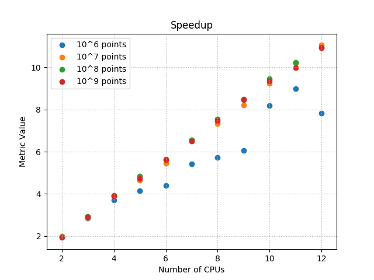
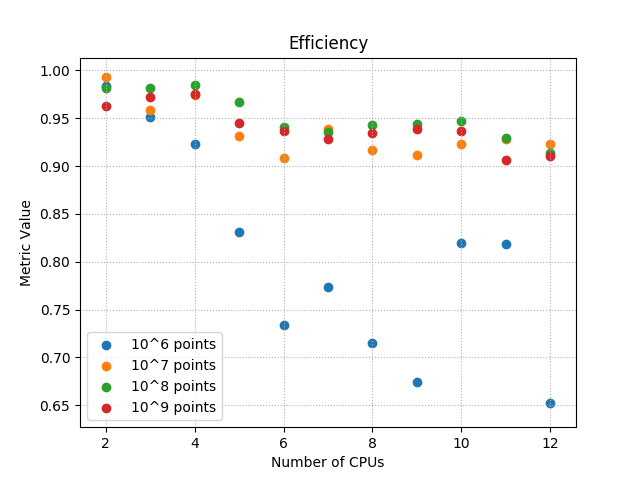
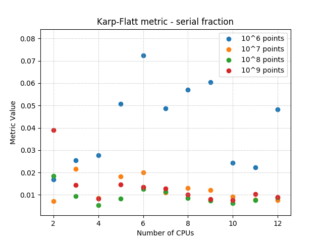

Wstęp
---
Celem ćwiczenia jest zrównoleglenie programu bazującego na metodzie Monte Carlo oraz
zapoznanie się z problemami charakteryzującymi się naturalną równoległością.

Eksperyment
---

Ekperyment polega na wyznaczeniu liczby PI, przy wykorzystaniu metody Monte Carlo.


w każym kroku algorytmu losowany jest punkt `(x,y), 0 <= x,y <= 1`. Z pewnością
znajduje się on wewnątrz kwadratu przedstawionego na diagramie. Załóżmy, że
dysponujemy nieskończoną liczbą takich losowych punktów, które mają rozkład
jednostajny. Wtedy możemy stwierdzić, że proporcja liczby punktów wenątrz 
ćwiartki koła `Pc` oraz wszystkich punktów (wewnątrz kwadratu) jest równa
propocji pola ćwiartki koła `Ac` oraz pola kwadratu `As`:
```
Pc/Ps=Ac/As
```
Możemy dostrzec, że promień koła jest równy boku kwadratu.  Podstawy wzory na
pole kwadratu oraz koła. 
```
Pc/Ps=(pi*r^2*1/4)/(r^2)
Pc/Ps=(pi*1/4)
pi = 4*Pc/Ps
```

Wykorzystując tę metodę, możemy szacować liczbę PI. Im więcej takich
punktów wygenerujemy, tym dokładniejszy wynik otrzymamy. Zadanie to
jest w sposób naturalny wysoce równoległe, gdyż zasadnicza część pracy nie
wymaga komunikacji pomiędzy wątkami. Składa się na nią:
 - wygenerowanie losowego punktu
 - sprawdzenie, czy punkt leży wewnątrz okręgu.

Jedyna wymagana komunikacja, to połączenie wyników otrzymanych przez
wszystkie wątki. Nie jest ona kosztowna, gdyż jedyna informacja, która musi
zostać przesłana, to ilość punktów, które każdy z wątków wylosował wewnątrz
okręgu.
Jeden z wątków, zbiera zatem te dane. Posiada on informacje, ile wątków
rozwiązywało ten problem, oraz jaki był jego rozmiar, dla każdego z nich.
Ostatecznie więc wynik to:

```
total_in_circle = sum(result of each worker)
pi = 4*total_in_circle/(total_points)
```

Zasadniczą częścią eksperymentu nie było obliczenie faktycznej wartości liczby PI.
Głównym celem, było zbadanie, w jaki sposób zrównoleglanie problemu wpływa
na szybkość uzyskania wyniku.

Podczas eksperymentu wykorzystano barierę tuż przed rozpoczęciem pracy, w celu
synchronizacji wątków i minimalizacji wpływu czasu startu na pomiar czasu.
Następnie mierzono czas, oraz wykonywano obliczenia. Tak szybko jak wyniki
obliczeń zostały zebrane, a wartość PI obliczona, następował koniec pomiaru czasu.

Metryki
---

### Przyśpieszenie (speedup)
Jest miarą, która mówi o ile obliczenie będzie wykonane szybciej, gdy dołożymy kolejny
procesor. Definiuje się jako iloraz czasu wykonania na jedny procesorze
oraz czasu wykonania na `n` procesorach.

### Wydajność (efficiency)
Jest miarą, która mówi w jakim stopniu została wykorzystana moc obliczeniowa,
gdy zostały dołożone kolejne procesory. Określić jaka część czasu została
wykorzystana na faktyczne obliczenia, a jaka została zmarnowana na
komunikację i synchronizację.
Definiuje się ją jako iloraz przyśpieszenia i liczby procesorów.

### Miara Karpa-Flatta
Pozwala określić jaka część algorytmu jest sekwencyjna.


Infrastruktura
---
Eksperyment został zrealizowany na klastrze obliczeniowym ZEUS.

Wykorzystano
 - jeden węzeł obliczeniowy
 - 12 procesorów węzła

Procesor na którym przeprowadzane były obliczenia:
```
    Intel(R) Xeon(R) CPU X5650 6C 2.66GHz
```

Wyniki
---

### Skalowane







### Nieskalowane


Wnioski i podsumowanie
---
- Zbyt mały rozmiar problemu, może prowadzić do degradacji wydajności.
- Problem obliczania liczby PI, wykorzystując metodę Monte Carlo jest naturalnie
  równoległy, o czym świadczą wartości metryk uzyskanych podczas doświadczeń.

Dodatek - ile wynosi pi?
---
Najdokładniejsza otrzymana wartość liczby PI podczas eksperymentów wynosiła
`3.14159231636`. Obliczono ją losując `11*10^9` punktów, wykorzystując 11 wątków.
Trwało to pół godziny.
