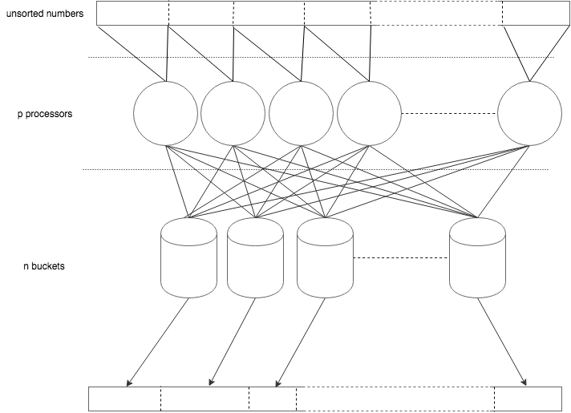

Wstęp
---
Celem ćwiczenia jest zbadanie zachowania sortowania przy wykorzystaniu
równoległej wersji sortowania kubełkowego zaimplementowanej przy wykorzystaniu
biblioteki OpenMP.

Eksperyment
---

Ekperyment polega na posortowaniu tablicy losowo wygenerowanych liczb, przy
wykorzystaniu zrównoleglonej metody sortowaniua kubełkowego. Sortowanie
zostało zrównoleglone na dwa sposoby.

### Metoda 1

Pierwszy ze sposobów zakładał istnienie globalnych kubełków, do których
dostęp będzie synchronizowany.




#### Określenie rozmiaru kubełków

Pierwszym krokiem było obliczenie ilości elementów w każdym z kubełków.
Każdy z wątków otrzymał zakres tablicy do przeszukania. Efektem tego działania
była tablica `occurences[bucket_no] = items in bucket`. Zapis do tej
tablicy odbywał się z każdego z wątków, zatem stanowiła ona sekcję
krytyczną. Później, na podstawie tej tablicy, obliczono kolejną tablicę
`starts`, które wskazywała początkowy indeks dla każdego z kubełków.
Dzięki temu jednoznaczenie można było określić gdzie w tablicy jest początek
oraz koniec każdego z kubełków.


#### Podział tablicy na kubełki

Kolejnym krokiem było przepisanie elementów z początkowej tablicy, do tablicy
docelowej. Jest to tożsame z podziałem na kubełki.
Możliwe to było dzięki wykorzystaniu tablicy `starts`.
Każdemu z kubełków został przypisany jeden wątek. Każdy z wątków przeszukuje
całą tablicę.
Gdy wątek trafi na element, który powinien trafić do "jego" kubełka przepisuje
go do docelowej tablicy z indeksem `starts[bucket_no]` oraz inkrementuje
wartość.
Takie podejście pozwala uniknąć potrzeby synchronizacji, ponieważ
każdy wartość jest modyfikowana jedynie przez jeden wątek.

Implementacja tej metody znajduje się w pliku `bucket.c`.

#### Sortowanie kubełków

Ostatnim krokiem jest posortowanie wartości w każdym z kubełków. Wykorzystana
do tego została funkcja `void qsort(void * tab, size_t num, size_t size, ( * comparator ) ( const void *, const void * ) );`
dostarczona przez bibliotekę standardową.


#### Pomiar czasu

Do pomiaru czasu wykorzystano funkcję z biblioteki OpenMP `double omp_get_wtime()`.
Pomiar rozpoczynał się po wypełnieniu tablicy, natomiast kończył gdy
każdy z kubełków został posortowany.

### Metoda 2

Metryki
---

### Przyśpieszenie (speedup)
Jest miarą, która mówi o ile obliczenie będzie wykonane szybciej, gdy dołożymy kolejny
procesor. Definiuje się jako iloraz czasu wykonania na jedny procesorze
oraz czasu wykonania na `n` procesorach.

### Wydajność (efficiency)
Jest miarą, która mówi w jakim stopniu została wykorzystana moc obliczeniowa,
gdy zostały dołożone kolejne procesory. Określić jaka część czasu została
wykorzystana na faktyczne obliczenia, a jaka została zmarnowana na
komunikację i synchronizację.
Definiuje się ją jako iloraz przyśpieszenia i liczby procesorów.

### Miara Karpa-Flatta
Pozwala określić jaka część algorytmu jest sekwencyjna.


Infrastruktura
---
Eksperyment został zrealizowany na klastrze obliczeniowym ZEUS.

Wykorzystano
 - jeden węzeł obliczeniowy
 - 12 procesorów węzła

Procesor na którym przeprowadzane były obliczenia:
```
    Intel(R) Xeon(R) CPU X5650 6C 2.66GHz
```

Wyniki
---

Zebrane dane dostępne są w pliku [data/result.csv](data/result.csv). Na ich
podstawie zostały wygenerowana seria wykresów, która ułatwia interpretację
danych (skrypt `parse_and_plot.py`). Poniżej znajdują się odnośniki do
wykresów:

|   Rozmiar   | Skalowane | Czas | Speedup | Efficiency | Serial Fraction |
|------------:|-----------|------|---------|------------|-----------------|
| 1 000 000   | Tak | [link [1]](imgs/size_1000000_scaled_True_time.png) | [link [2]](imgs/size_1000000_scaled_True_speedup.png) | [link [3]](imgs/size_1000000_scaled_True_efficiency.png)  | [link [4]](imgs/size_1000000_scaled_True_serial_fraction.png) |
| 10 000 000  | Tak | [link [5]](imgs/size_10000000_scaled_True_time.png) | [link [6]](imgs/size_10000000_scaled_True_speedup.png) | [link [7]](imgs/size_10000000_scaled_True_efficiency.png)  | [link [8]](imgs/size_10000000_scaled_True_serial_fraction.png) |
| 100 000 000 | Tak | [link [9]](imgs/size_100000000_scaled_True_time.png) | [link [10]](imgs/size_100000000_scaled_True_speedup.png) | [link [11]](imgs/size_100000000_scaled_True_efficiency.png)  | [link [12]](imgs/size_100000000_scaled_True_serial_fraction.png) |
| 1 000 000   | Nie | [link [13]](imgs/size_1000000_scaled_False_time.png) | [link [14]](imgs/size_1000000_scaled_False_speedup.png) | [link [15]](imgs/size_1000000_scaled_False_efficiency.png)  | [link [16]](imgs/size_1000000_scaled_False_serial_fraction.png) |
| 10 000 000  | Nie | [link [17]](imgs/size_10000000_scaled_False_time.png) | [link [18]](imgs/size_10000000_scaled_False_speedup.png) | [link [19]](imgs/size_10000000_scaled_False_efficiency.png)  | [link [20]](imgs/size_10000000_scaled_False_serial_fraction.png) |
| 100 000 000 | Nie | [link [21]](imgs/size_100000000_scaled_False_time.png) | [link [22]](imgs/size_100000000_scaled_False_speedup.png) | [link [23]](imgs/size_100000000_scaled_False_efficiency.png)  | [link [24]](imgs/size_100000000_scaled_False_serial_fraction.png) |

Wnioski i podsumowanie
---

 - Złożoność obliczeniową implementacji można oszacować na `O(n)`, co
   można stwierdzić na podstawie pomiaru czasu dla takich samych parametrów
   eksperymentu, dla różnych rozmiarów problemu (np. dla jednego wątku,
   dla 10 kubełków, przy 10-krotnym zwiększaniu rozmiaru problemu - sortowanie
   trwało odpowiednio `0,43s`, `4,81s`, `55s`, co daje wzrost  `11,19` i `11,43` - krotny
   wzrost czasu rozwiązywania problemu.
 - Eksperymenty przeprowadzono dla 3 rozmiarów problemów `10^6, 10^7 i 10^8`.
   Na podstawie wyników, można stwierdzić, że rozmiar problemu `10^6` jest
   za mały (1,2,13,14).
 - Problem ten nie jest w pełni możliwy do zrównoleglenia. Możemy to stwierdzić
   na podstawie [10], gdzie zmierzony punkty układają się w krzywą, która
   asymptotycznie zmierza do określonej wartości (zaczyna dominować część
   sekwencyjna problemu).
 - Eksperymenty przeprowadzono dla następujących rozmiarów kubełków: `1/10`,
   `1/100`, `1/1000`, `1/10 000`, `1/100 000` całkowitej liczby elementów.
 - W zależności od rozmiaru kubełka, program w różny sposób się skalował.
   Najlepiej skalowały się przypadki z większą ilością kubełków (12, 24).
