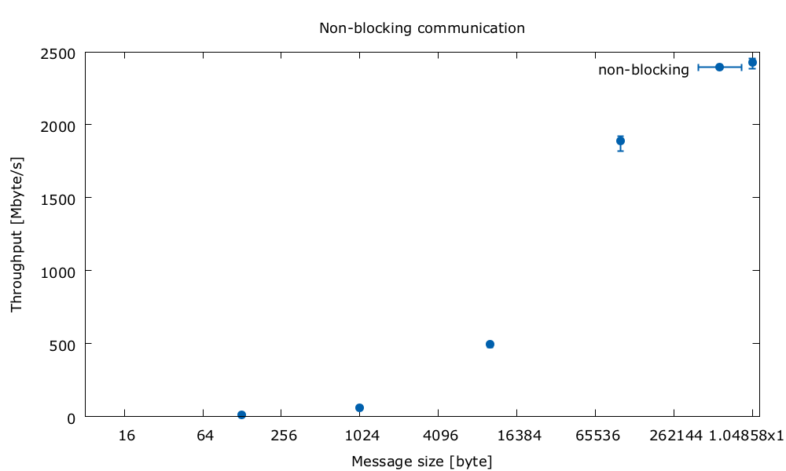

Wstęp
---

Celem zadanie jest zapoznanie się z podstawowym interfejsem MPI, poprzez zmierzenie opóźnienia i przepustowości połączeń w klastrze.

Eksperyment
---

Do przetestowanie wybrano dwa rodzaje komunikacji: blokującą oraz nie blokującą.
Pierwszy rodzaj jest zrealizowany poprzez wykorzystanie funkcji `MPI_Send` oraz `MPI_Recv`, natomiast drugi wykorzystuje `MPI_Isend` oraz `MPI_Irecv`.
Każdy z zestawów funkcji został wykorzystany zmierzenia przepustowości i opóźniania w klastrze.

### Przepustowość i komunikacja blokująca

Celem jest zmierzenie przepustowości pomiędzy dwoma instancjami.
W celu synchronizacji, ustawiona została bariera tuż przed rozpoczęciem właściwego eksperymentu.
Następnie, tuż po przejściu bariery, pierwsza z instancji pobiera aktualny timestamp (`t1`).
Jest on dodawany wiadomości, które będę przesyłane.
Pierwsza z instancji wysyła dane do drugiej, a następnie oczekuje na wiadomość zwrotną.
Druga z instancji. w pierwszej kolejności oczekuje na dane od pierwszej.
Gdy wiadomość nadejdzie, wysyła kolejną wiadomość zwrotną.

Każda z wiadomości ma zadany rozmiar `N`.
Program działa tak długo, dopóki każda z instancji programu nie prześle `1GB` danych.
Po przesłaniu `1GB` danych druga z instancji pobiera aktualny timestamp (`t2`).
Wyniki eksperymentu są obliczane na podstawie ilości przesłanych danych oraz różnicy timestampów: ( [code](https://github.com/bszaf/tpr/blob/master/sync_send_recv.c#L103-L104) )
```
throughput = dane/(t2-t1)
```


### Przepustowość i komunikacja nieblokująca

Eksperyment analogiczny do poprzedniego.
Zasadniczna różnica polega na sposobie presyłania danych.
Pierwsza instancja wysyła nieblokująco dane, a następnie nieblokująco oczekuje na wiadomość zwrotną.
Druga odwrotnie - nieblokująca oczekuje na dane, a następnie nieblokująco odsyła wiadomość zwrotną.
Ponieważ obie instancje wykorzystują ten sam obszar pamięci do przechowywania danych, konieczna jest synchronizacja.
W tym celu, po tych krokach obie instancji wywołują funkcję `MPI_Waitall(3)` ( [code](https://github.com/bszaf/tpr/blob/master/async_send_recv.c#L106) ).
Wyniki eksperymentu obliczane są w identyczny sposób.


### Opóźnienie i komunikacja blokująca

Celem eksperymentu jest zmierzenie opóźnienia dla przesłania widomości o małym rozmiarze.
Jako prykładowa widomość przesyłana jest wartość `long`, zatem jej rozmiar na testowanym systemie to 8 bajtów.
Ponieważ nie jest możliwe dokładne zmiarzenie czasu przesłania jednej wiadomości, zastosowano inną strategię.
Podczas testu przesyłana jest duża ilość wiadomości, aby zminimalizować wpływ pomiaru na wyniki.
Czas mierzony jest dla wszystkich przesłanych wiadomości podczas testu, natomiast czas przesłania pojedyńczej wiadomości to: ( [code](https://github.com/bszaf/tpr/blob/master/async_short_msg.c#L64) )
```
one_msg_time = total_time/number_of_transfers
```

Tuż przed rozpoczęciem eksperymentu ustawiona jest bariera w celu synchronizacji instancji.
Następnie pierwsza z instacji wysyła wiadomość i oczekuje na wiadomość zwrotną.
Drugi instancja - oczekuje na wiadomość, a następnie odsyła wiadomość zwrotną.

Po zakończeniu pobierany jest aktualny timestamp, w celu obliczenia wyniku eksperymentu.

### Opóźnienie i komunikacja nieblokująca

Eksperyment analogiczny do poprzedniego

Infrastruktura
---

Klaster jest zrealizowany jako maszyny wirtualne na dwóch fizycznych hostach.
Parametry każdego z fizycznych hostów, które udało mi się znaleźć:
```
    Intel(R) Xeon(R) CPU E5649  @ 2.53GHz
        Liczba rdzeni: 6
        Liczba wątków: 12
    Pamięć: 96 GB
```

Każdy z hostów wirtualizuje kolejna maszyny.
Wirtualizowane są dwa rodzaje maszyn. Pierwsza z nich to:
 - 4 wątki
 - 32 GB pamięci
 - CentOS Linux release 7.4.1708 (Core)
 - kernel 3.10.0-693.17.1.el7.x86_64

Druga to:
 - 1 wątek
 - 8 GB pamięci
 - CentOS Linux release 7.4.1708 (Core)
 - kernel 3.10.0-693.17.1.el7.x86_64

Pierwszy fizyczny host wirtualizuje 3 pierwsze maszyny.
Drugi fizyczny host wirtualizuje 1 maszynę pierwszego typu i 8 drugiego.

Maszyny wirtualne raportują interfejs sieciowy z linkiem `10 000Mb/s`, jednak nie można mieć pewności, czy rzeczywiście jest to wiarygodna przepustowość.

Wyniki
---

### Przepustowość i komunikacja blokująca - przez pamięć współdzieloną, jeden host

Każdy z eksperymentów został wykonany 20 razy.
Na wykresie zaznaczono maksymalną, średnią oraz minimalną wartość.


### Przepustowość i komunikacja nieblokująca - przez pamięć współdzieloną, jeden host
Każdy z eksperymentów został wykonany 20 razy.
Na wykresie zaznaczono maksymalną, średnią oraz minimalną wartość.


### Przepustowość i komunikacja blokująca - przez sieć, jeden host
Każdy z eksperymentów został wykonany 8 razy.
Na wykresie zaznaczono maksymalną, średnią oraz minimalną wartość.


### Przepustowość i komunikacja nieblokująca - przez sieć, jeden host
Każdy z eksperymentów został wykonany 8 razy.
Na wykresie zaznaczono maksymalną, średnią oraz minimalną wartość.



### Opóźnienie

Każdy z eksperymentów został wykonany 100 razy.
Miało to na celu zminimalizowanie wpływu innych czynników na wyniki.

| Rodzaj komunikacji | Sposób wymiany danych | Średnia `[ns]` | Minimum `[ns]` | Maximum `[ns]` | Ilość Prób |
| ------------------ | --------------------- | -------------- | -------------- | -------------- | ---------- |
| blokująca          | pamięć współdzielona  | 685,33         | 628            | 1013           | 100        |
| nieblokująca       | pamięć współdzielona  | 493,61         | 461            | 719            | 100        |
| blokująca          | sieć                  | 34085,63       | 31285          | 39010          | 100        |
| nieblokująca       | sieć                  | 24614,82       | 23173          | 25809          | 100        |

Wnioski i podsumowanie
---
 - Komunikacja przy użyciu pamięci współdzielonej jest wyraźnie wydajniejsza niż przy wykorzystaniu sieci.
 - Rozmiar przesyłanych komunikatów ma wpływ na przepustowość.
   Najmniejsze porcje danych wyraźnie zmniejszają przepustowość.
   Wraz ze wzrostem rozmiaru danych wydajność ulega poprawie.
 - W przypadku większych porcji danych, w komunikacji wykorzystującej pamięć współdzieloną, można zaobserować duże fluktuacje.
   Może to wynikać z osiągnięcia "limitu" przepustowości, wyznaczonego przez architekturę MPI i inne czynniki niezależne (np. scheduler systemowy).
 - Komunikacja nieblokująca pozwala na osiągnięcie nieznacznie większej przepustowości.
 - Komunikacja nieblokująca umożliwa wyraźnie szybsze przesyłanie wiadomości o małym rozmiarze.
